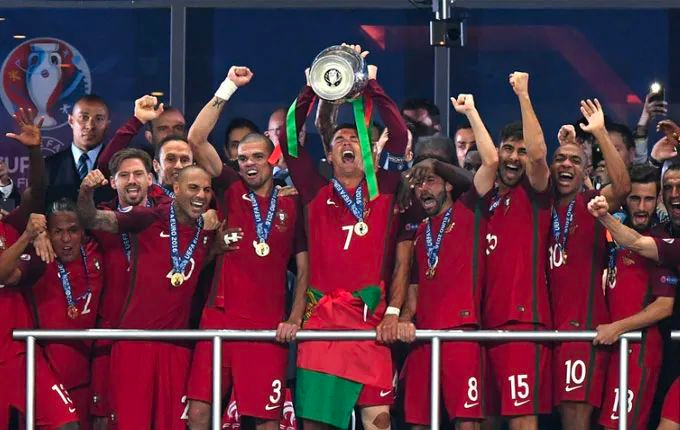
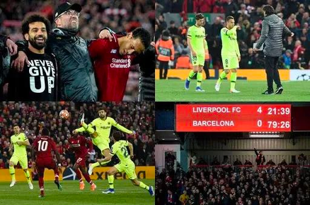

作为世界第一大运动，足球把后工业时代的团队协作、简单高效体现的淋漓尽致，同时又蕴藏着不同地区的哲学共鸣、文化差异。

足球带给我们共鸣，能够在很短的时间内体会极致的酸甜苦辣，对生活在这个麻木城市的普通人是一针精神吗啡，让无处宣泄的情绪一瞬间在90分钟可以完全释放。像饮了一杯浓茶，像干了一瓶啤酒，胜利是我，失败也是我，然后拍拍灰尘继续向前。

足球带给我们积极的人生态度，就像会长说的：人或体育，尤其竞技体育，不能消极。任何东西要积极正面的面对以后，才会有好的结果。中国拼命进12强赛干啥，很可能被淘汰。韩日进世界杯干啥，又拿不了冠军。人活着干啥，早晚都会死。足球如此、人生亦如此，难道向上攀爬的那条路不是比站在顶峰更让人热血澎湃吗？

